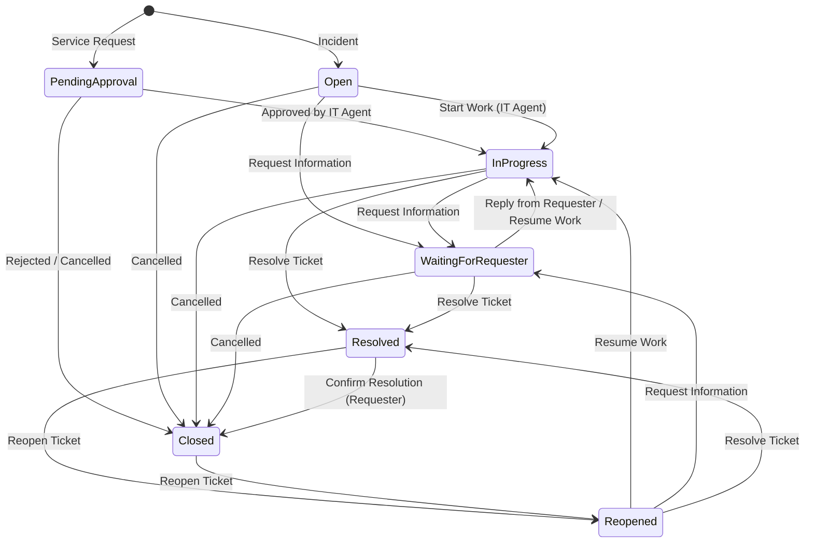

<p align="center">
  <picture>
    <source media="(prefers-color-scheme: dark)" srcset="public/assets/images/logo_alt.png">
    <source media="(prefers-color-scheme: light)" srcset="public/assets/images/logo.png">
    
  </picture>
</p>

<p align="center">
  <a href="https://github.com/tomylana93/nova-helpdesk/actions/workflows/tests.yml"></a>
  
  
  
  
  
  
</p>

# Nova Helpdesk

Nova Helpdesk is a modern, single-company internal IT Helpdesk system designed to manage and resolve support tickets (incidents and service requests) across multiple company branches. The platform is built on Laravel 13, Fortify, and Inertia Vue 3, featuring a responsive, state-of-the-art user interface styled with Tailwind CSS v4.

---

## 🚀 Key Features

- **Ticketing Core & Lifecycle**: Supports Incidents and Service Requests. A strict backend state machine (`TicketStatus`) governs ticket transitions (`Open`, `PendingApproval`, `InProgress`, `WaitingForRequester`, `Resolved`, `Closed`, `Reopened`).
- **Service Request Approvals**: Service requests enter a `PendingApproval` state where the assigned IT Agent (not the super admin) must approve or reject the request before work begins.
- **SLA Policies & Calculations**: Auto-calculates first response and resolution due timestamps on ticket creation based on ticket type and priority (`Low`, `Medium`, `High`, `Urgent`).
- **Personalized Notifications**: Direct updates delivered to the user's personal channel via Reverb websockets and database notifications (auto-assigned alerts, SLA warnings/breaches, replies).
- **Master Data Management**: Super Admin panel to manage users, branches, departments, ticket categories, and SLA policies.
- **Branded Theme**: Fully dynamic layout variables, dark mode preference cookies, custom site name database settings (falling back to "Nova Helpdesk"), and typography.
- **Semantic Versioning (SemVer)**: Release Please manages stable and release-candidate versions from Conventional Commits, with the runtime version exposed through `config/version.php`.

---

## 🛠️ Technology Stack

- **Backend**:
    - PHP 8.5 & Laravel 13
    - Laravel Fortify (Authentication backend)
    - Inertia.js (Inertia Laravel v3)
    - Spatie Laravel Settings (Branding & General Settings persistence)
    - Spatie Laravel Permission (Roles & Permissions catalog)
    - Spatie Laravel MediaLibrary (Avatar & Upload attachments)
    - Spatie Laravel Query Builder (API filtering & server-driven tables)
- **Frontend**:
    - Vue 3 & TypeScript
    - Tailwind CSS v4 (with Vite integration)
    - Reka UI & Lucide Vue Icons
    - Laravel Wayfinder (Auto-generated typed Laravel routes in Vue)
- **Testing & Quality Assurance**:
    - Pest PHP v4
    - PHPStan (Larastan v3)
    - Rector (Automatic refactoring)
    - Laravel Pint (PHP formatting)
    - Prettier & ESLint (Frontend styling and lint checks)

---

## 💻 Getting Started

### Prerequisites

- PHP 8.5 or higher
- Node.js & `pnpm`
- SQLite (default database connection)

### Installation & Setup

Set up your database, install dependencies, run migrations, and compile assets in one command:

```bash
composer run setup
```

### Running the Local Development Stack

Start the Laravel local server, queue listener, Vite dev server, and Reverb websocket server concurrently:

```bash
composer run dev
```

### Application Versioning

Version bumps are handled by Release Please from Conventional Commits. Pushes to `dev` maintain release-candidate PRs, and pushes to `main` maintain stable release PRs. The application reads the current version from `config/version.php`.

### Deployment

Production is deployed **locally**, from an exact stable release tag — never from GitHub Actions and never from RC/`dev` state. GitHub Actions is responsible only for CI and Release Please metadata/tags.

Infra targets (SSH host, paths, Reverb host) are not baked into the tracked script. Copy `.env.deploy.example` to `.env.deploy` (git-ignored) once and fill in your values:

```bash
cp .env.deploy.example .env.deploy   # first time only; edit DEPLOY_HOST, DEPLOY_ROOT, REVERB_HOST
```

```bash
git fetch origin --prune --tags
git checkout main && git pull --ff-only origin main
git checkout vX.Y.Z          # exact stable tag (no -rc)
composer ci:check            # optional local gate
./deploy.sh vX.Y.Z
```

`deploy.sh` refuses to run unless the working tree is clean, the tag is a stable `vX.Y.Z` (RC tags rejected), `HEAD` is exactly that tag's commit, and `config/version.php` matches. It builds assets locally, uploads a `vX.Y.Z-<hash>` release via rsync, then runs remote Composer/migrations/role-sync/cache/symlink/prune and restarts the Reverb + queue workers. Production secrets live only in the server-provisioned `/srv/nova-helpdesk/shared/.env`; the deploy script never creates that file and never writes DB credentials or other secrets into it (it fails clearly if the file is missing). The only value it may write is a generated `APP_KEY`, and only when one is absent on first deploy.

---

## 👥 Personas & Roles

| Role                      | Ticket Lifecycle                                                                                                                | System & Master Data                                                                    |
| :------------------------ | :------------------------------------------------------------------------------------------------------------------------------ | :-------------------------------------------------------------------------------------- |
| **`requester`**           | Create tickets, track progress, add replies, confirm resolution, reopen tickets. _Must belong to a branch and department._      | None (Read-only portal)                                                                 |
| **`it_agent`**            | Approve/reject service requests, start work, resolve tickets, add public/internal notes.                                        | None (Read-only master data)                                                            |
| \***\*`super_admin`\*\*** | Read-only oversight of the ticket database. Excluded from the ticketing lifecycle (no assignment, approvals, or notifications). | Full management of system settings, style, and master data (users, branches, SLA, etc.) |

---

## 🧪 Testing & Quality Gate

Verify code quality, formatting, typescript types, static analysis, and execute the test suite before committing:

```bash
# Run Pint, Prettier, TypeScript compile, PHPStan, Rector dry-run, and Pest test suite
composer run ci:check

# Run tests only
composer test

# Run a focused test
php artisan test --compact --filter=TicketLifecycleTest
```

---

## 🔄 Ticket Lifecycle State Machine

Below is the state transition diagram showing how support tickets (Incidents and Service Requests) move through the lifecycle status machine (`TicketStatus`):



---

## 💻 Custom Artisan Commands Reference

Nova Helpdesk includes custom Artisan commands to manage application data, setup roles, check SLAs, and accelerate development:

| Command                    | Description                                                                                                        | Example Usage                                           |
| :------------------------- | :----------------------------------------------------------------------------------------------------------------- | :------------------------------------------------------ |
| `init:superadmin`          | Seed the default Super Admin user using details configured in your `.env`.                                         | `php artisan init:superadmin`                           |
| `app:import-master-data`   | Import initial system master data (users, departments, branches, SLA policies, and categories) from CSV templates. | `php artisan app:import-master-data`                    |
| `app:check-sla-escalation` | Check for SLA warning/breach conditions and dispatch notifications/alerts. Run this on a cron scheduler.           | `php artisan app:check-sla-escalation`                  |
| `sync:roles`               | Synchronize the Spatie roles and permissions catalog defined in the backend codebase.                              | `php artisan sync:roles`                                |
| `make:action`              | Create a new thin action class for business/domain logic under `app/Actions`.                                      | `php artisan make:action Actions/Helpdesk/CreateTicket` |
| `make:table`               | Create boilerplate schema properties for DataTable client-side integration.                                        | `php artisan make:table TicketTable`                    |
| `prune:temporary-uploads`  | Prune expired or orphaned temporary media upload attachments from storage.                                         | `php artisan prune:temporary-uploads`                   |
| `lang:export` (via `pnpm`) | Export backend PHP translations to frontend JSON files.                                                            | `pnpm run lang:export`                                  |

---

## ⚙️ Key Environment Variables (`.env`)

Configure these essential keys in your `.env` to enable specific application systems:

| Variable                | Description                                                                | Default / Recommended      |
| :---------------------- | :------------------------------------------------------------------------- | :------------------------- |
| `DB_CONNECTION`         | Backend database driver. Uses SQLite locally for zero-config.              | `sqlite`                   |
| `BROADCAST_CONNECTION`  | Driver for real-time events. Set to `reverb` for live notifications.       | `reverb` (or `log` in dev) |
| `QUEUE_CONNECTION`      | Queue worker driver. Ensure `php artisan queue:listen` runs in production. | `database`                 |
| `NOVA_SUPERADMIN_NAME`  | Default name of the Super Admin user when running `init:superadmin`.       | `"Super Admin"`            |
| `NOVA_SUPERADMIN_EMAIL` | Default email of the Super Admin user when running `init:superadmin`.      | `"admin@novacore.com"`     |
